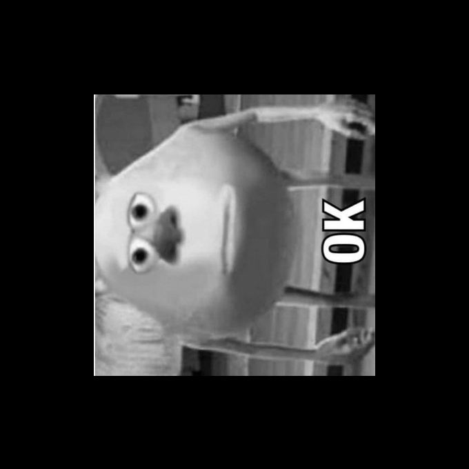
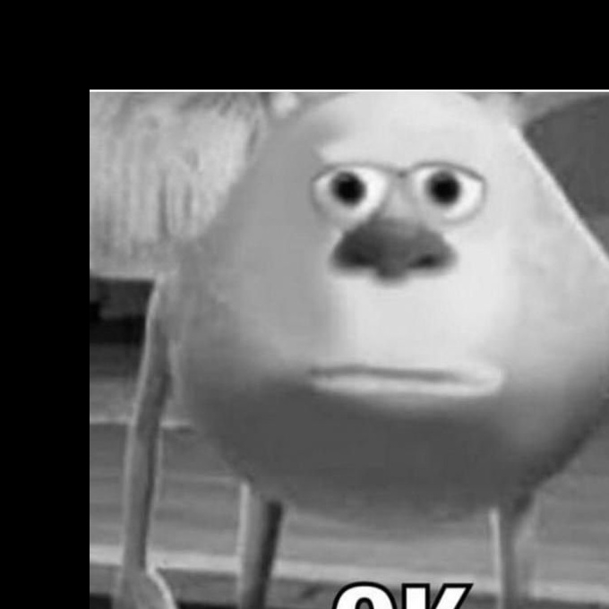
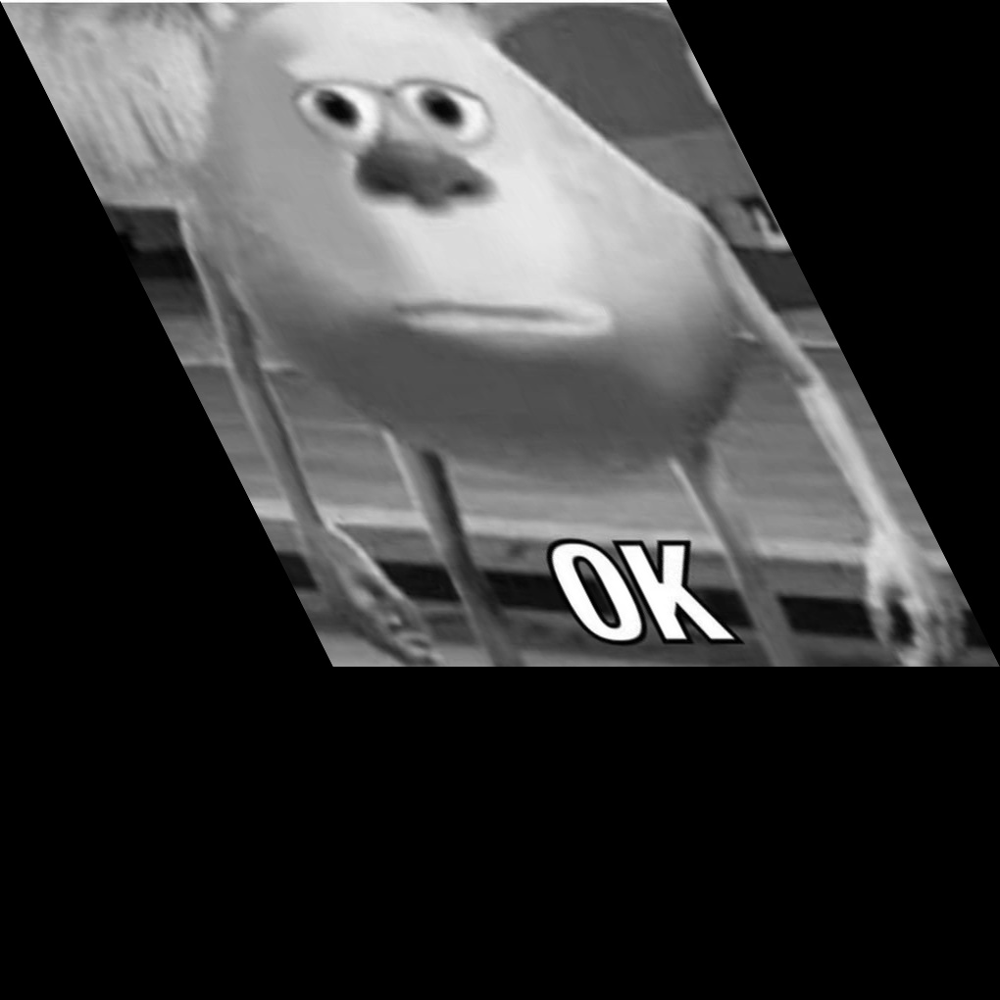
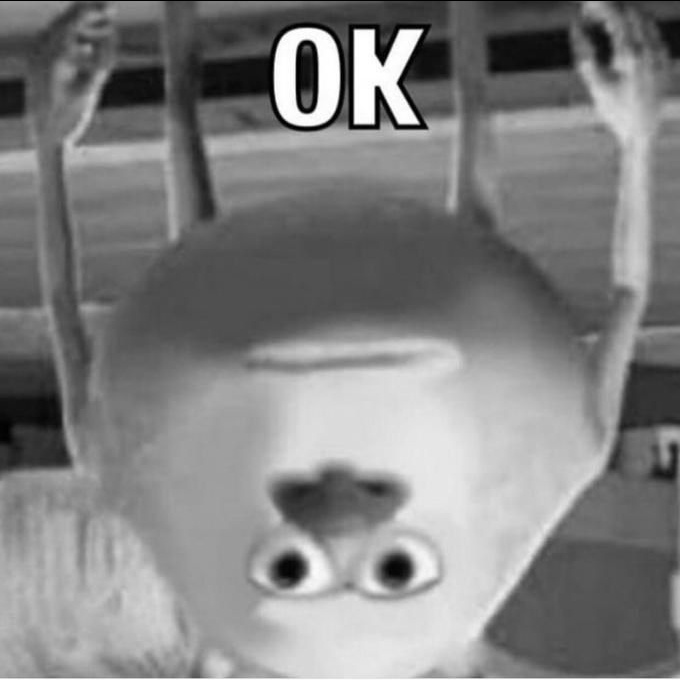

# Basics & IO

This module covers the fundamental operations in Computer Vision using OpenCV.

## Concepts Covered

*   **Reading and Writing Images**: Loading images from disk and saving them.
*   **Image Dimensions**: Understanding height, width, and number of channels.
*   **Resizing**: Changing the size of an image (Upscaling/Downscaling).
*   **Cropping**: Extracting a region of interest (ROI).
*   **Geometric Transformations**:
    *   **Rotation**: Rotating an image by a certain angle.
    *   **Translation**: Shifting an image in the x or y direction.
    *   **Flipping**: Mirroring an image horizontally or vertically.
    *   **Shearing**: Skewing an image.
*   **Splitting Channels**: Separating an image into its Blue, Green, and Red components.

## Examples

The script uses `ok.jpg` as the base image for most examples.

| Original | Rotated (180°) | Translated |
| :---: | :---: | :---: |
|  |  |  |

| Sheared | Flipped |
| :---: | :---: |
|  |  |

## Scripts

*   `image_dimensions.py`: Prints image shape and details.
*   `image_scaling_resize_interpolation.py`: Resizes images using different interpolation methods.
*   `image_cropping.py`: Crops a specific region from an image.
*   `image_rotation.py`: Performs image rotation.
*   `image_translation.py`: Shifts the image.
*   `image_sampling.py`: Demonstrates upsampling and downsampling.
*   `video_read.py`: Basic script to read video files.
