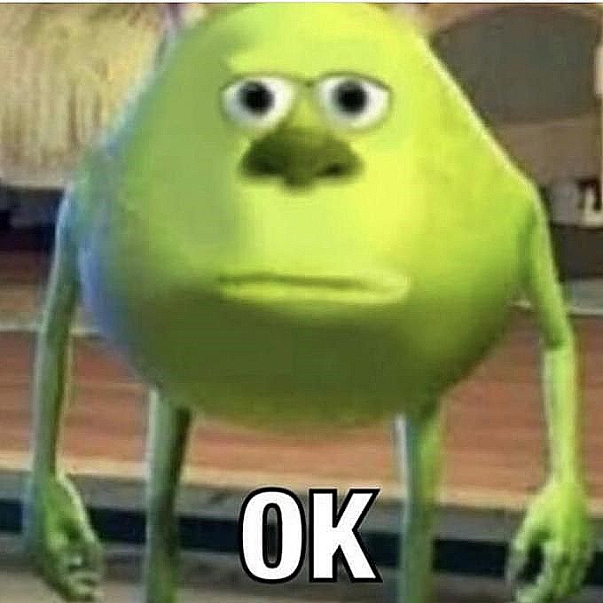
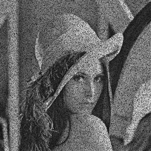
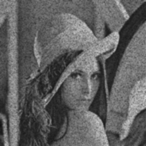
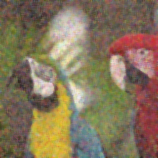

# Image Filtering

Image filtering is used to modify or enhance an image. It involves convolving a kernel with the image.

## Concepts Covered

*   **Blurring (Smoothing)**: Reduces noise and detail.
    *   **Simple Blurring/Averaging**: Convolving with a normalized box filter.
    *   **Gaussian Blur**: Uses a Gaussian kernel. Effective for Gaussian noise.
    *   **Median Blur**: Replaces pixel value with the median of neighboring pixels. Excellent for "Salt and Pepper" noise.
    *   **Bilateral Filtering**: Preserves edges while smoothing textures.
*   **Sharpening**: Enhances edges and fine details.
*   **Embossing**: Creates a 3D effect.
*   **Custom Convolutions**: Applying arbitrary kernels.

## Examples

### Blurring vs Sharpening
| Original | Blurred (Avg) | Sharpened |
| :---: | :---: | :---: |
|  |  |  |

### Noise Reduction (Gaussian vs Median)
| Noisy Input | Gaussian Blur |
| :---: | :---: |
|  |  |

| Noisy Input (Salt & Pepper) | Median Blur (Best Result) |
| :---: | :---: |
|  |  |

## Scripts

*   `image_blurring.py`: Basic averaging blur.
*   `image_gaussian_blur.py`: Applies Gaussian blur.
*   `image_median_blur.py`: Applies Median blur.
*   `image_bilateral_filtering.py`: Applies Bilateral filter.
*   `image_sharpening.py`: Applies a sharpening kernel.
*   `image_emboss.py`: Applies an emboss kernel.
*   `image_neighbourhood.py`: Demonstrates manual neighborhood operations (custom filtering).
