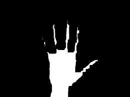

# Morphological Transformations

Morphological transformations are simple operations based on the image shape. They are typically performed on binary images. Ideally, we need two inputs: the original image and a structuring element (kernel).

## Concepts Covered

*   **Erosion**: Erodes away the boundaries of the foreground object. Useful for removing white noise, detaching two connected objects, etc.
*   **Dilation**: Increases the object area. Useful for joining broken parts of an object.
*   **Opening**: Erosion followed by Dilation. Good for removing noise from the background.
*   **Closing**: Dilation followed by Erosion. Good for closing small holes inside the foreground objects.
*   **Morphological Gradient**: The difference between dilation and erosion of an image. Result looks like the outline of the object.
*   **Top Hat**: Difference between input image and Opening of the image.
*   **Black Hat**: Difference between the Closing of the input image and input image.

## Examples

### Erosion (Iterative)
As iterations increase, the white object becomes thinner.

| Original | Erosion (n=1) | Erosion (n=5) |
| :---: | :---: | :---: |
|  |  |  |

### Dilation (Iterative)
As iterations increase, the white object becomes thicker.

| Original | Dilation (n=1) | Dilation (n=5) |
| :---: | :---: | :---: |
|  |  |  |

### Opening vs Closing
| Original | Opening (Noise Removal) | Closing (Hole Filling) |
| :---: | :---: | :---: |
|  |  |  |

### Complex Image Example (Rick)
| Original | Erosion (n=2) | Dilation (n=2) |
| :---: | :---: | :---: |
|  |  |  |

## Scripts

*   `image_erosion.py`: Performs erosion with varying iterations.
*   `image_dilation.py`: Performs dilation with varying iterations.
*   `image_opening.py` / `image_closing.py`: Compound operations.
*   `image_morph_gradient.py`: Computes the morphological gradient.
*   `image_structuring_element.py`: Using different kernel shapes (Rect, Cross, Ellipse).
