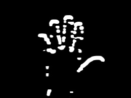

# Edge Detection

Edge detection is a technique to identify the boundaries of objects within images.

## Concepts Covered

*   **Canny Edge Detection**: A popular multi-stage algorithm. It uses Gaussian blur, finding intensity gradients, non-maximum suppression, and hysteresis thresholding.
*   **Sobel Operator**: Computes the gradient approximation of image intensity function. It focuses on finding horizontal (dy) and vertical (dx) edges.
*   **Laplacian**: Calculates the Laplacian of an image (second derivative), effectively spotting areas of rapid intensity change.

## Examples

### Canny Edge Detection
Canny provides thin, clean edges.

| Original | Canny Output |
| :---: | :---: |
|  |  |

### Laplacian
Detects all edges but can be sensitive to noise (hence blurring is often used first).

| Original | Laplacian Output |
| :---: | :---: |
|  |  |

### Sobel (X vs Y)
Sobel can separate horizontal and vertical edges.

| Sobel X (Vertical Lines) | Sobel Y (Horizontal Lines) | Combined |
| :---: | :---: | :---: |
|  |  |  |

## Scripts

*   `image_canny_edge_detection.py`: Implements Canny edge detection.
*   `image_sobel_edge_detection.py`: Implements Sobel edge detection.
*   `image_laplacian_edge_detection.py`: Implements Laplacian edge detection.
