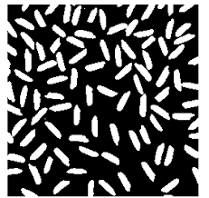
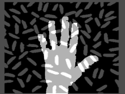
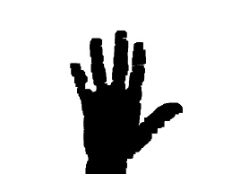

# Arithmetic & Logic Operations

Perform arithmetic and logical operations on images pixel by pixel.

## Concepts Covered

*   **Image Addition**: Adding two images. Saturated operation (250+10 = 260 => 255).
*   **Image Subtraction**: Subtracting pixel values.
*   **Image Blending**: Mixing two images with meaningful weights (Transparency). `g(x) = (1 - \alpha)f_0(x) + \alpha f_1(x)`.
*   **Bitwise Operations**: AND, OR, XOR, NOT. Useful for extracting parts of images, defining non-rectangular ROIs, etc.

## Examples

### Image Blending
Blending two binary images with different weights.

| Image 1 | Image 2 | Blended |
| :---: | :---: | :---: |
|  |  |  |

*(Note: If `output_image_blending.png` is not generated, run `image_blending.py` to create `output_image_blending_gamma_point_5.png`)*

### Bitwise NOT
Inverting the colors.

| Original | Inverted (NOT) |
| :---: | :---: |
|  |  |

## Scripts

*   `image_arithmetic.py`: Basic addition.
*   `image_blending.py`: Weighted addition interaction.
*   `image_substraction.py`: Subtracting images.
*   `image_bitwise_not.py`, `image_bitwise_xor.py`: Logical operations.
