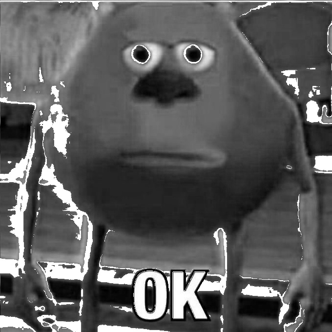

# Histograms & Intensity Transformations

Understand contrast, brightness, and intensity distribution of images.

## Concepts Covered

*   **Histogram**: A graph showing the distribution of pixel intensities.
*   **Histogram Equalization**: Method to contrast adjustment using the image's histogram. Good for images with background and foreground that are both dark or both bright.
*   **Power Law (Gamma) Transformation**: Non-linear operation to map image intensity.
    *   `Gamma < 1`: Make dark regions lighter (bleach).
    *   `Gamma > 1`: Make dark regions darker.

## Examples

### Power Law (Gamma) Transformation

| Original | Gamma 0.2 | Gamma 1.5 |
| :---: | :---: | :---: |
|  |  |  |

### Piecewise Linear
 Contrast stretching.

| Original | Transformed |
| :---: | :---: |
|  |  |

## Scripts

*   `image_histogram.py`: Plots histogram.
*   `image_histogram_eq.py`: Performs equalization.
*   `image_power_law_transform.py`: Applies Gamma correction.
*   `image_piecewise_linear.py`: Linearly stretches contrast.
