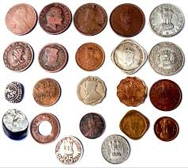
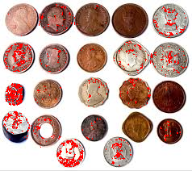
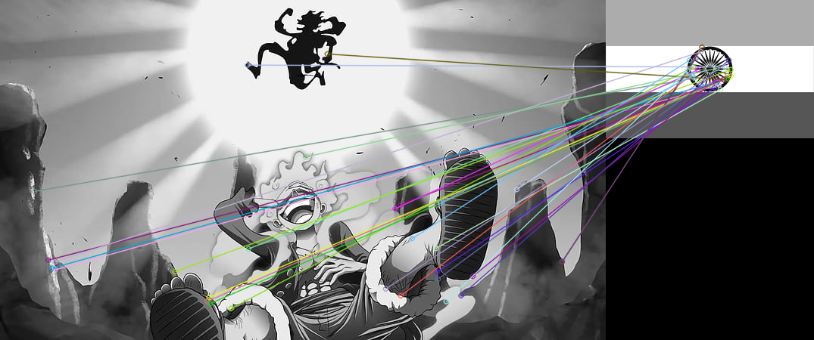

# Image Features & Segmentation

Detecting keypoints and matching features across images.

## Concepts Covered

*   **Harris Corner Detection**: Detects corners (regions with high intensity variation in all directions).
*   **Feature Matching**: Finding corresponding points between two images.
    *   **Brute-Force Matcher**: Matches descriptor of one feature in first set with all other features in second set using some distance calculation.
    *   **BRISK (Binary Robust Invariant Scalable Keypoints)**: A feature point detection and description algorithm.
*   **Segmentation**: Partitioning an image into multiple segments (sets of pixels).

## Examples

### Harris Corner Detection
Red dots indicate detected corners.

| Original | Corners Detected |
| :---: | :---: |
|  |  |

### Feature Matching (BRISK)
Matching features between two images (Luffy and Flag).

| Feature Matching |
| :---: |
|  |

## Scripts

*   `image_feature_harris.py`: Detects corners.
*   `image_feature_matching.py`: Basic feature matching.
*   `image_feature_matching_brisk.py`: Using BRISK.
*   `image_segmentation.py`: Various segmentation techniques.
